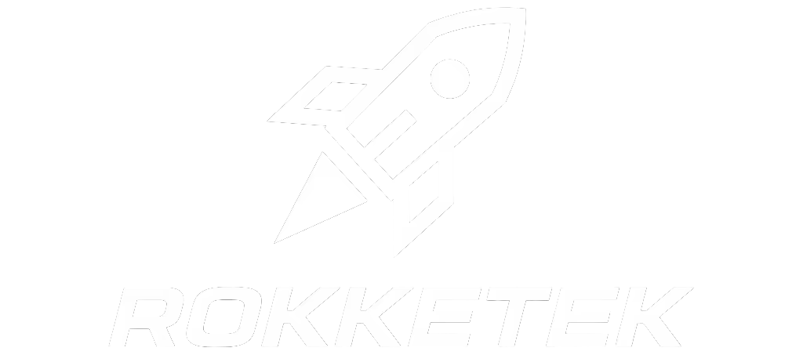

<p align="center">
  
</p>

A VS Code extension that provides a rich GUI for Claude Code CLI and Codex CLI — with Telegram remote control, push-to-talk voice input, and a polished webview interface.

## Features

- **Claude Code & Codex support** — switchable provider backends, both using their native streaming JSON APIs
- **Telegram remote control** — send prompts, receive responses, and monitor agent activity from your phone
- **Push-to-talk voice input** — hold the mic button to record, release to transcribe and send
- **Streaming responses** — real-time token streaming with tool call visibility
- **Tool call tracking** — see each tool call as it runs with inline result summaries

## Requirements

- VS Code 1.80+
- [Claude Code CLI](https://docs.anthropic.com/en/docs/claude-code) installed and authenticated (`claude --version`)
- Node.js 18+ (for Claude Code CLI)
- Optional: OpenAI API key for Codex support
- Optional: Telegram bot token for remote control

## Getting Started

1. Install the extension from the VS Code Marketplace
2. Open the RokketWrapper panel from the Activity Bar
3. Configure your provider in Settings (`Ctrl+,` → search `rokketWrapper`)
4. Start a conversation

### Telegram Setup

1. Create a bot via [@BotFather](https://t.me/botfather)
2. Add your bot token to `rokketWrapper.telegram.botToken`
3. Start a chat with your bot and send `/start`
4. The extension will sync your chat ID automatically

## Configuration

| Setting | Description | Default |
|---|---|---|
| `rokketWrapper.provider` | Active provider: `claudeCode` or `codex` | `claudeCode` |
| `rokketWrapper.claudeCode.executable` | Path to `claude` binary (auto-detected if omitted) | `""` |
| `rokketWrapper.claudeCode.model` | Model override | `""` |
| `rokketWrapper.codex.apiKey` | OpenAI API key | `""` |
| `rokketWrapper.codex.model` | Codex model | `"codex-mini-latest"` |
| `rokketWrapper.telegram.botToken` | Telegram bot token | `""` |
| `rokketWrapper.telegram.chatId` | Authorized Telegram chat ID | `""` |
| `rokketWrapper.voice.language` | Whisper transcription language | `"en"` |

## Architecture

```
src/
  extension/
    provider/
      IAgentProvider.ts       ← provider interface (events + methods)
      ClaudeCodeProvider.ts   ← claude --output-format stream-json adapter
      CodexProvider.ts        ← OpenAI Responses API adapter (M002)
    telegram/
      bridge.ts               ← Telegram bot ↔ provider bridge
    webview-provider.ts       ← VS Code WebviewPanel host
    voice-transcription.ts    ← push-to-talk → Whisper
  webview/
    index.ts                  ← webview UI (vanilla DOM)
```

The provider interface emits 8 normalised events: `message_chunk`, `message_end`, `agent_start`, `agent_end`, `tool_call`, `tool_result`, `error`, `log`. All UI code works against these events — switching providers requires no UI changes.

## Development

```bash
npm install
npm run watch        # incremental build
# Press F5 in VS Code to launch Extension Development Host
```

### Building

```bash
npm run compile      # single build
npm run package      # vsce package → .vsix
```

### Testing

```bash
npm test
```

## Contributing

See [CONTRIBUTING.md](CONTRIBUTING.md).

## Security

See [SECURITY.md](SECURITY.md) for how to report vulnerabilities.

## Changelog

See [CHANGELOG.md](CHANGELOG.md).

## License

MIT
